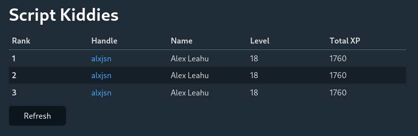

# Bootdev Clan

This is a little [Boot.dev](https://boot.dev) leaderboard web application for you and your friends so that you can keep track of everyone's progress and get a little competitive. This feature wasn't available so I made it to scratch my own itch.



## Run Binary

Configuration is performed using environment variables, so make sure to set those.

```
TITLE="Script Kiddies" USERNAMES=username1,username2,username3 go run main.go
```

## Docker

You can use either `docker` or `docker compose`:

```
docker build -t bootdev-clan .
docker run -p 8000:8000 --env-file env --rm bootdev-clan
```

```
docker compose up
```
